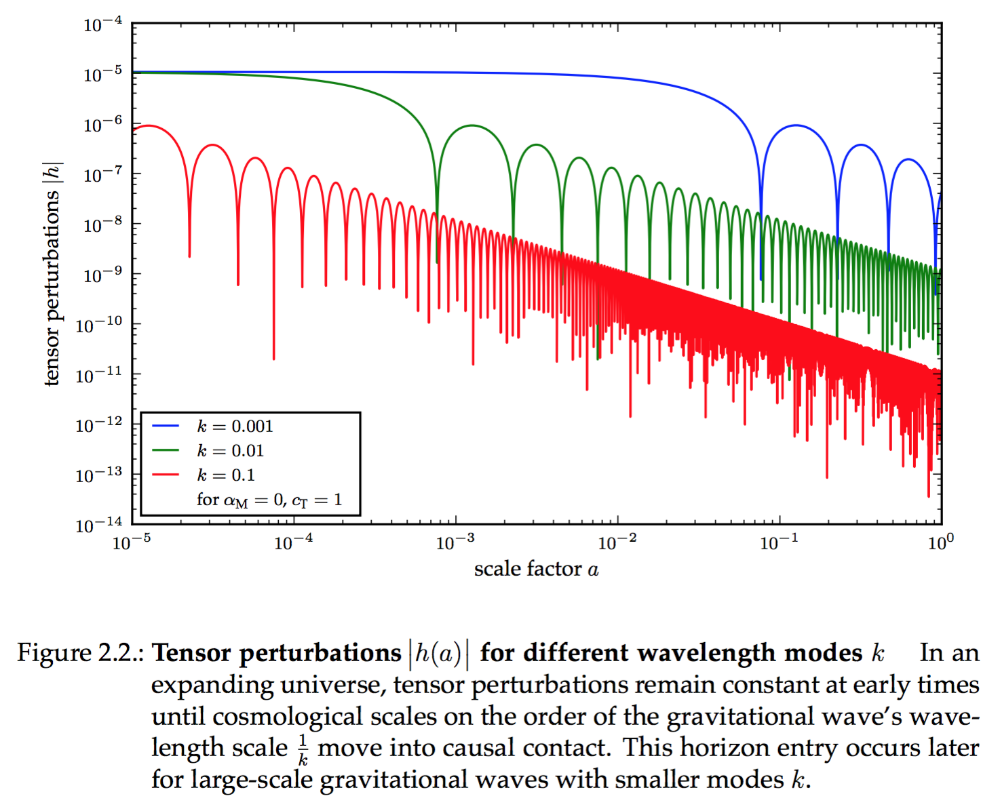

# TexFig

[](https://zenodo.org/badge/latestdoi/53438825)

Python's [Matplotlib](http://matplotlib.org) can save plots as [PGF vector files](https://en.wikipedia.org/wiki/PGF/TikZ), with text containing LaTeX code and all. LaTeX can render PGF files. Sounds like a perfect match, doesn't it? (It does. See [my bachelor thesis](https://github.com/knly/bsc-thesis/blob/master/dist/bsc_digital.pdf) for example plots.)




## Why PGF?

- It's a vector format. No blurry pixel graphics anymore!
- Any text in your plots will be typeset with your document's native font and style.
- You can use your custom LaTeX `\newcommand` macros in your plots after defining a dummy implementation for them in Python. They will be typeset correctly in your document.


## Usage

1. [Download](https://github.com/nilsleiffischer/texfig/archive/master.zip) the repository and run

 	```bash
	python example.py
	```

	to test your Python and LaTeX setup.
2. Copy the `texfig.py` file next to your Python script. It is just some simple setup and utility code for `matplotlib` to get you started, so feel free to edit any configurations within.
3. Use `texfig` to generate PGF plots:

	```python
	# import texfig first to configure Matplotlib's backend
	import texfig  # assuming texfig.py and an __init__.py is in the directory
	# then, import PyPlot as usual
	import matplotlib.pyplot as plt

	# obtain a nicely configured figure from texfig
	fig = texfig.figure()
	# plot as usual
	plt.plot(range(10))
	# save your plot as both a PGF file (for inclusion in LaTeX) and a PDF file (for preview only)
	texfig.savefig("example_plot")
	```

	You can adjust the settings in `texfig.py` to your liking. In particular, you may want to set the `default_width` to your LaTeX `\textwidth` (in inches). In the `pgf.preamble` list you can also define any macros that you have implemented in your LaTeX document and that you wish to use in your plots. Don't worry about implementing them correctly here, since they are rendered by your LaTeX document later anyway.

	> Make sure that no call to change matplotlib backends precedes the `import texfig` statement, and do not change backends afterwards either. In particular, refrain from using `%matplotlib inline` configurations in Jupyter Notebooks.

4. Now `\usepackage{pgf}` and `\input` the PGF file in your LaTeX document:

	```tex
	% in the preamble
	\usepackage{pgf}
	% somewhere in your document
	\input{example_plot.pgf}
	```

5. Admire the beauty of LaTeX vector plots.

> Hint: If your PGF plots end up slowing down your LaTeX compile times too much, consider omitting the PGF rendering in `draft` mode like so:
>
> ```tex
> % in the preamble
> \usepackage{ifdraft}
> \newcommand{\plot}[1]{\ifdraft{\includegraphics{#1.pdf}}{\input{#1.pgf}}}
> % somewhere in your document
> \plot{example_plot}
> ```
>
> Now when you give your `\documentclass` the option `draft`, a placeholder of the correct size is rendered instead of the PGF plot. Note that for this to work you need to keep the preview PDF generated by `texfig.savefig` in addition to the corresponding PGF file in the same directory.

## Contact

TexFig was created and is maintained by [Nils Leif Fischer](https://nilsleiffischer.de).


## License

TexFig is released under the MIT license. See [LICENSE.md](LICENSE.md) for details.
